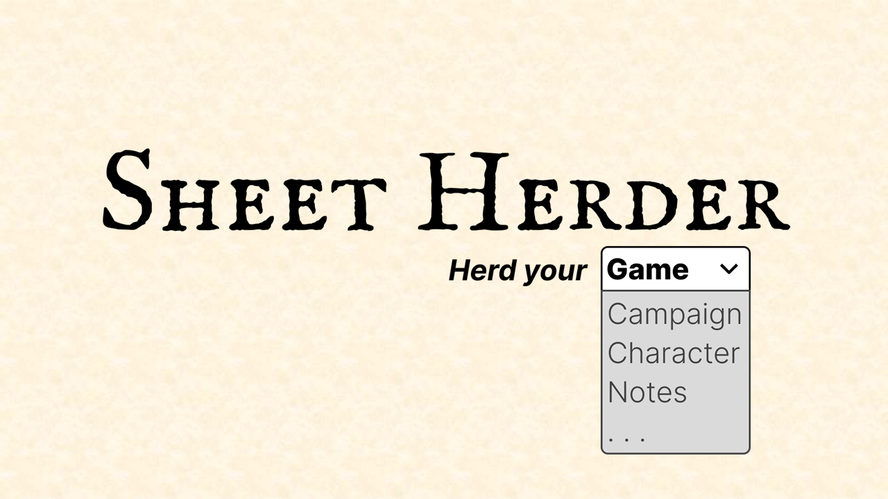
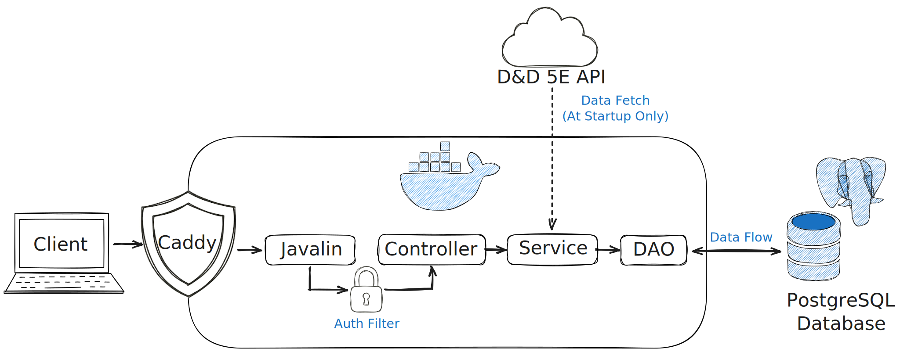
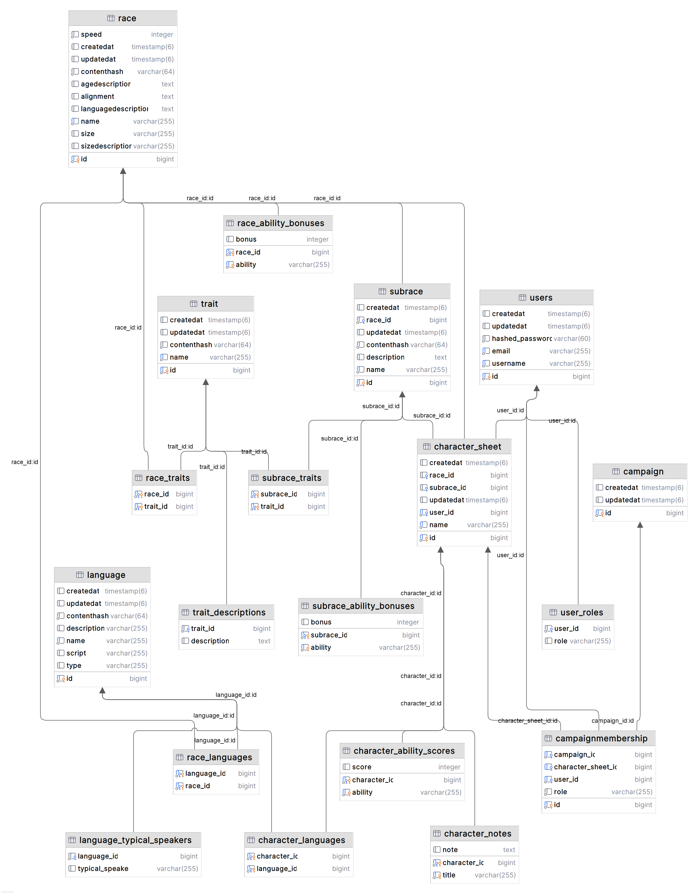

# Sheet Herder

## Contributors

**Daniel Hangaard**
cph-dh258@stud.ek.dk
github.com/DHangaard

## Vision



This project is a backend API for a _Table Top Roleplaying Game_ (TTRPG) companion application, **Sheet Herder**. The system allows players to create and manage their characters and personal notes, while game masters can organize campaigns, track session progress, and keep an eye on their party — all in one place.

---

## Links

Portfolio website:
[dhangaard.dk](https://dhangaard.dk/)

Project overview video (max 5 min):  
[video demo](https://youtube.com)

Deployed application (optional):  
[sheet-herder-api.dhangaard.dk](https://sheet-herder-api.dhangaard.dk/routes)

Source code repository:  
[github.com/DHangaard/sheet-herder](https://github.com/DHangaard/sheet-herder)

---

## Architecture

### System Overview

Sheet Herder is built as a layered backend architecture with clear separation between concerns:

- **Controller layer** — handles HTTP endpoints and request validation
- **Service layer** — owns business logic and domain rules
- **DAO layer** — manages database access via JPQL
- **Entity layer** — JPA-mapped domain models

**Technologies used:**

- Java 17
- Javalin 7
- JPA / Hibernate 7 + HikariCP
- PostgreSQL
- JWT authentication (Nimbus JOSE+JWT)
- Maven (shade plugin → `app.jar`)
- Docker + Caddy (reverse proxy, automatic TLS)
- DigitalOcean
- JUnit Jupiter, REST Assured, Testcontainers (testing)
- D&D 5e REST API (external reference data)

### Architecture Diagram



### Key Design Decisions

#### Project Structure

The project is organized into distinct layers — controllers handle HTTP and request validation, services own business logic, DAOs handle database access, and entities model the domain. Dependencies only flow downward; no layer reaches up.

All controllers, services, and DAOs are defined behind interfaces. This follows the Dependency Inversion principle — components depend on abstractions, not concrete implementations. It also enforces a clear contract for each layer and keeps them independently testable.

All DTOs are implemented as Java records — immutable by design, with no boilerplate. A DTO that carries data in one direction has no business being mutable.

#### Security

Passwords are hashed using BCrypt with a cost factor of 12. Before hashing, the plain password is prehashed with SHA-256 and Base64-encoded — this removes BCrypt's 72-byte input limit and ensures full password entropy is preserved regardless of length.

Authentication is implemented using JWT tokens via a custom wrapper around Nimbus JOSE+JWT. On login, a signed token is issued and must be included in all subsequent requests. As a fail-fast measure, missing `JWT_SECRET` or `JWT_ISSUER` environment variables crash the application immediately on startup — a missing configuration should never surface as a cryptic runtime error.

Authorization is enforced through Javalin before-filters. Public endpoints are marked explicitly with `Role.ANYONE` — making access intent visible in the route definition rather than relying on the absence of a role check.

#### Error Handling

All domain exceptions extend `ApiException`, which carries an HTTP status code. `ApiException` is never thrown directly — only its subtypes are. This means every exception type is explicit about its intent.

Two handlers cover all cases. Known exceptions are caught as `ApiException`, logged at `WARN`, and returned as a controlled `{"status": ..., "message": ...}` shape. Everything else is caught as `Exception`, logged at `ERROR` with the full stack trace, and always returns a generic 500 — internal details never reach the client.

The request logger follows the same logic: 5xx logs at `ERROR`, 4xx at `WARN`, everything else at `INFO`. The health check endpoint actively probes the database with a `SELECT 1` query and returns `503 Service Unavailable` if the connection fails — giving the load balancer an accurate picture of application health.

---

## Data Model

### ERD



### Important Entities

#### User

Represents a registered user in the system.

**Fields:**

- `id` — auto-generated primary key
- `username` — unique, required, trimmed on persist and update
- `email` — unique, required, lowercased and trimmed on persist and update
- `hashedPassword` — BCrypt-hashed with SHA-256 prehash
- `roles` — set of `Role` enums, defaults to `USER` on creation
- `characterSheets` — owned character sheets; deleting a user cascades to all of them

#### CharacterSheet

Represents a D&D 5e character owned by a user. A user can own multiple character sheets; names are unique per user.

**Fields:**
- `id` — auto-generated primary key
- `name` — character name, trimmed and validated on persist and update
- `race` — reference to `Race`
- `subrace` — reference to `Subrace`
- `languages` — many-to-many reference to `Language`
- `abilityScores` — map of `Ability` enum to integer score
- `notes` — map of title to note text
- `user` — owning user (FK)

#### Campaign and CampaignMembership

Modelled but not yet implemented. `Campaign` represents a game master's campaign, and `CampaignMembership` links users and their characters to it with a role — reflecting that the same user can be a player in one campaign and a game master in another.

#### Reference Data

`Race`, `Subrace`, `Trait`, and `Language` are populated from the D&D 5e REST API at startup and persisted locally. Each entity carries a SHA-256 content hash — on every startup, incoming records are compared against stored ones and only changed or new records are written.

---

## API Documentation

All errors follow this format:

```json
{ "status": 404, "message": "Explains the problem" }
```

### Auth

| Method | URL                     | Request Body         | Response           | Status    |
| ------ | ----------------------- | -------------------- | ------------------ | --------- |
| POST   | `/api/v1/auth/register` | `RegisterRequestDTO` | `LoginResponseDTO` | 201 / 409 |
| POST   | `/api/v1/auth/login`    | `LoginRequestDTO`    | `LoginResponseDTO` | 200 / 401 |

#### RegisterRequestDTO

```json
{ "email": "String", "username": "String", "password": "String" }
```

#### LoginRequestDTO

```json
{ "email": "String", "password": "String" }
```

#### LoginResponseDTO

```json
{ "token": "String (JWT)" }
```

### Character Sheets

Requires: `Authorization: Bearer <token>`

| Method | URL                             | Request Body              | Response              | Status                |
| ------ | ------------------------------- | ------------------------- | --------------------- | --------------------- |
| GET    | `/api/v1/character-sheets`      |                           | `[CharacterSheetDTO]` | 200                   |
| GET    | `/api/v1/character-sheets/{id}` |                           | `CharacterSheetDTO`   | 200 / 403 / 404       |
| POST   | `/api/v1/character-sheets`      | `CreateCharacterSheetDTO` | `CharacterSheetDTO`   | 201 / 400 / 409       |
| PUT    | `/api/v1/character-sheets/{id}` | `UpdateCharacterSheetDTO` | `CharacterSheetDTO`   | 200 / 400 / 403 / 404 |
| DELETE | `/api/v1/character-sheets/{id}` |                           |                       | 204 / 403 / 404       |

#### CreateCharacterSheetDTO

```json
{
  "name": "String",
  "raceId": "Long",
  "subraceId": "Long",
  "languageIds": "[Long]",
  "abilityScores": "{ Ability: Integer }"
}
```

#### UpdateCharacterSheetDTO

```json
{
  "name": "String",
  "raceId": "Long",
  "subraceId": "Long",
  "languageIds": "[Long]",
  "abilityScores": "{ Ability: Integer }",
  "notes": "{ String: String }"
}
```

#### CharacterSheetDTO

```json
{
  "id": "Long",
  "userId": "Long",
  "name": "String",
  "raceId": "Long",
  "raceName": "String",
  "subraceId": "Long",
  "subraceName": "String",
  "languages": "[LanguageDTO]",
  "abilityScores": "{ Ability: Integer }",
  "notes": "{ String: String }",
  "createdAt": "DateTime",
  "updatedAt": "DateTime"
}
```

The API also exposes reference data endpoints for races, subraces, traits, and languages, as well as user management and a health check endpoint.

---

## User Stories

The following user stories represent the implemented scope of the project. They cover the core functionality that the system is built around — authentication, character management, and the reference data that supports it. All user stories including full acceptance criteria can be found in [user stories](.docs/user-stories.md).

### US-1: User Authentication

> _As a user, I want to register and log in, so that I can access and manage my characters._

### US-2: Create and Manage Characters

> _As a player, I want to create, edit, and delete characters, so that I can manage my tabletop characters digitally._

### US-4: Character Overview

> _As a player, I want to see an overview of all my characters, so that I can easily manage and access them._

### US-5: Character Notes

> _As a player, I want to add and edit notes on my character, so that I can keep track of story events and development._

### US-12: Reference Data for Character Creation

> _As a user, I want access to predefined reference data during character creation, so that I can create characters consistently._

---

## Development Notes

### Domain Modeling

Early in the project, a significant amount of time was spent on analysis before writing any code. The goal was to ensure that the domain model reflected the actual problem being solved — not the technology used to solve it. Entities were kept lean and named after concepts that made sense in the context of a TTRPG companion, rather than after database tables or framework conventions. This approach made later implementation decisions easier to reason about, because the model had a clear real-world anchor.

### JPA Relations

Designing the entity relationships was one of the more time-consuming parts of the project. The default approach was to keep associations unidirectional — a deliberate choice to reduce coupling between entities and limit how much each entity needs to know about the rest of the model. In practice, this required careful thought about ownership and how data would flow through the system.

Reference data entities — races, subraces, traits, and languages — ended up using `FetchType.EAGER` across the board. This was a conscious trade-off: given that reference data is always needed when mapping a character sheet, lazy loading would only add complexity without meaningful benefit at the scale this application operates at.

### Testing

Tests were not written to achieve coverage numbers — they were written to verify that the system behaves correctly according to its specification. The process started with the acceptance criteria and business rules, which were used to derive concrete test cases. Some tests map directly to a specific user story or business rule. Integration tests run against a real PostgreSQL instance via Testcontainers, meaning the tests reflect actual database behavior rather than mocked substitutes.

### Logging

Logback is configured with three appenders: console output for development, a rolling application log (daily rotation, 30-day retention), and a dedicated error log (weekly rotation, 13-week retention). Log level is controlled via the `LOG_LEVEL` environment variable, making it configurable per environment without touching code. Third-party frameworks are capped at `WARN` to suppress noise from Hibernate, Jetty, HikariCP, and Testcontainers. The one exception is `HikariDataSource`, which logs at `INFO` to confirm connection pool startup. Startup time and reference data fetch duration are tracked using a custom `ExecutionTimer` utility, which logs elapsed time at key points in the startup sequence.

### CI/CD

Every push to `main` triggers a GitHub Actions pipeline that builds the project, runs the full test suite, and pushes a new Docker image to Docker Hub. After a successful push, the pipeline triggers a Watchtower webhook via a restricted SSH key, which instructs the running container to pull and redeploy the new image automatically. Watchtower's default polling interval of 60 seconds was sufficient for most cases, but implementing the webhook was a deliberate choice — an opportunity to work with a deployment mechanism I had not used before, with the added benefit of near-instant redeployment on every passing build.

--- 

## License

The source code in this repository is licensed under the MIT License.
See the [LICENSE](./LICENSE) file for details.

**Note:** The project name, logo, and visual identity are **not** included under the MIT License. Please refer to [BRANDING.md](./BRANDING.md) for usage guidelines and copyright information regarding these assets.